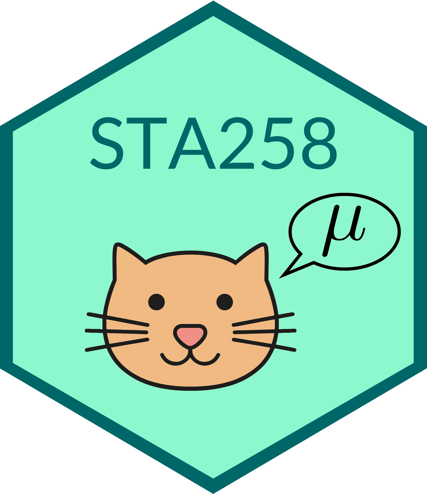

::: {.cover-img}
{alt="" aria-hidden="true" width="43%" fig-align="center"}
:::

  <h1 class="welcome-title">Tutorials</h1>

---

This site contains customized tutorials for <a href="https://utm.calendar.utoronto.ca/course/sta258h5" target="_blank">STA258</a>.

Please select a tutorial in the dropdown menu.

<!--
<h3>About the course</h3>

<a href="https://utm.calendar.utoronto.ca/course/sta258h5" target="_blank">STA258</a> 
is an Applied Statistics course at the 
<a href="https://www.utm.utoronto.ca/" target="_blank">University of Toronto Mississauga</a> 
which discusses a survey of statistical methodology with emphasis on the relationship between data analysis and probability theory. Topics covered include descriptive statistics, limit theorems, sampling distribution, point and interval estimation, hypothesis testing, contingency tables and count data, simple linear regression. 
-->

---

<h3>Authors</h3>

Aarushi Alreja 
 
<a class="github-button" href="https://github.com/aarushi-codes" data-color-scheme="no-preference: light; light: light; dark: dark;" data-size="large" aria-label="@aarushi-codes on GitHub">Follow @aarushi-codes</a>

Kabir Bhatia 
 
<a class="github-button" href="https://github.com/kabir-codes" data-color-scheme="no-preference: light; light: light; dark: dark;" data-size="large" aria-label="@kabir-codes on GitHub">Follow @kabir-codes</a>

Nishan Mudalige
 
<a class="github-button" href="https://github.com/nishanmudalige" data-color-scheme="no-preference: light; light: light; dark: dark;" data-size="large" aria-label="@nishanmudalige on GitHub">Follow @nishanmudalige</a>

 

